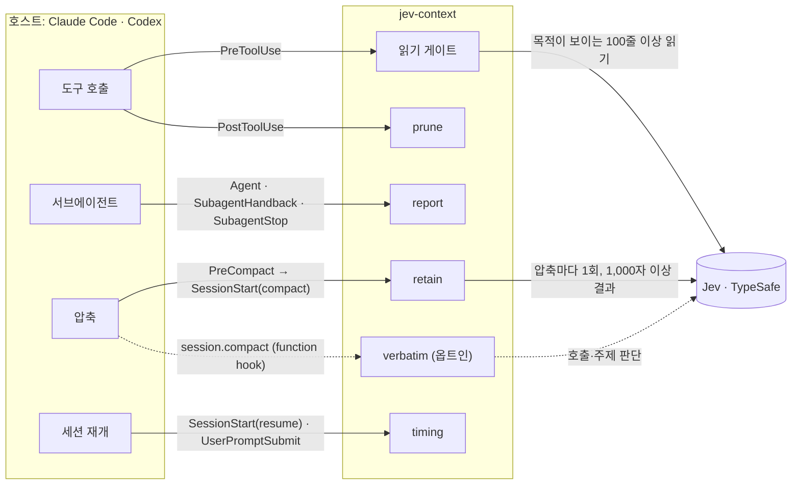
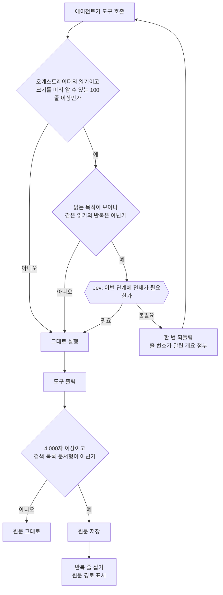
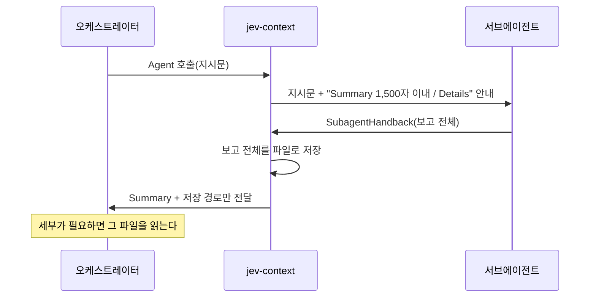
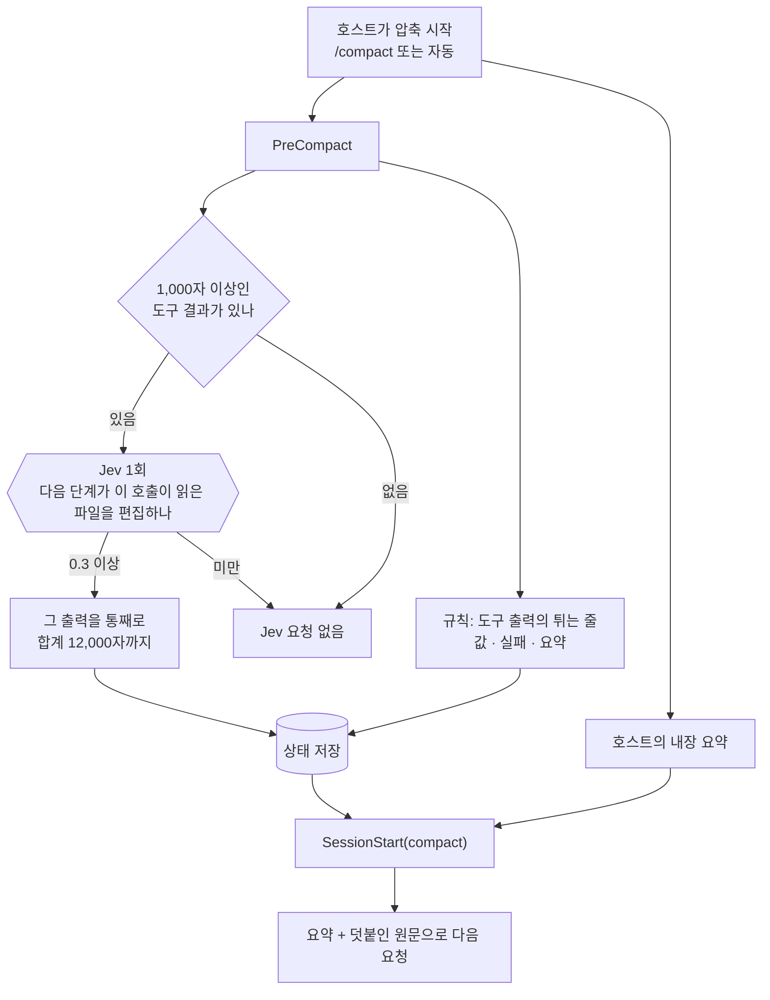
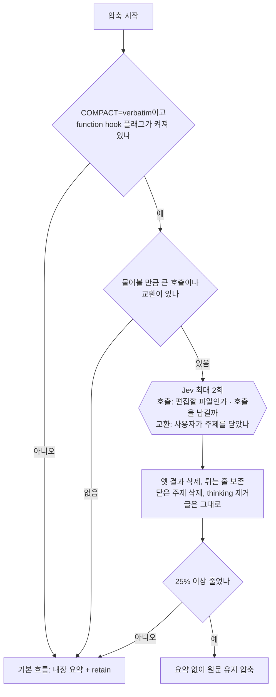
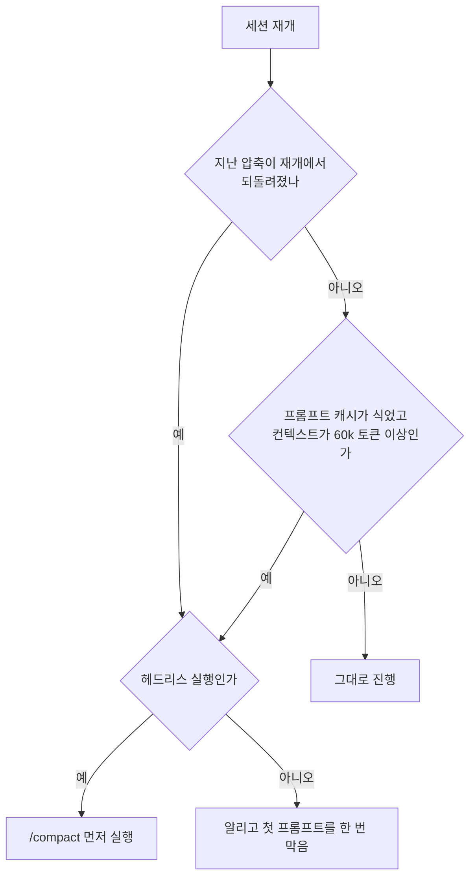

# jev-context

Claude Code와 Codex에서 쓰는 플러그인이다. 컨텍스트 창을 가볍게 유지해 **압축(compaction)을 최대한 늦추고**, 압축이 오더라도 필요한 원문이 살아남게 한다. 판단이 필요한 몇 곳에서만 TypeSafe의 **Jev** 모델을 부른다. [jev-pruner](https://github.com/tamaratran/jev-pruner)(출력 가지치기)와 [fast-jev-compaction](https://github.com/tamaratran/fast-jev-compaction)(압축 판단)을 하나로 합쳐 다시 설계했다.

원칙은 셋이다.

1. **들어오는 순간에 한 번 정하고, 그 뒤로는 고치지 않는다.** 이미 보낸 기록을 고치면 프롬프트 캐시가 깨진다. Opus 5.5·Sonnet 5.5에서는 그 뒤의 thinking 블록도 무효가 된다(preserved thinking).
2. **숨기기 전에 원문을 먼저 저장한다.** 줄인 결과에는 항상 원문 경로가 붙는다.
3. **Jev는 기본으로 켜 두되, 필요할 때만 부른다.** 규칙으로 정할 수 없고 Jev의 답이 결과를 바꿀 수 있는 곳에서만 요청을 보낸다.

## 전체 구성



| 모듈 | 하는 일 | Claude Code 2.1.284 | Codex 0.158.0 |
| --- | --- | --- | --- |
| **읽기 게이트** | 오케스트레이터가 100줄 이상을 한꺼번에 읽으려 할 때, 이번 단계에 전체가 필요한지 Jev가 판단한다. 필요 없으면 줄 번호가 달린 개요와 함께 한 번 되돌려 좁혀 읽게 한다. 같은 읽기를 다시 요청하면 통과한다 | `PreToolUse(Bash\|Read)` 거부 | `PreToolUse(Bash)` 거부 |
| **prune** | 도구 출력이 들어올 때 반복 줄을 규칙으로 접는다. 원문은 먼저 저장하고 경로를 남긴다 | `PostToolUse(Bash)` `updatedToolOutput` | `PreToolUse(Bash)`로 실행기 감싸기(옵트인) |
| **report** | 서브에이전트에게 `## Summary`와 `## Details`로 나눠 보고하게 하고, 오케스트레이터에는 Summary와 전체 보고 파일 경로만 전달한다 | `PreToolUse(Agent\|Task\|SubagentHandback)` | `SubagentStop`(긴 보고를 한 번 되돌림) |
| **retain** | 압축은 호스트의 내장 요약이 하고, retain은 그 옆에 원문을 덧붙인다. 규칙으로 튀는 줄(값·실패·요약)을 고른다. Jev에게 압축마다 한 번 "다음 단계가 편집할 출력"을 물어 그 출력을 통째로 붙인다 | `PreCompact` → `SessionStart(compact)` | 같음 |
| **timing** | 프롬프트 캐시가 이미 식었을 때만 압축을 권한다. 재개가 압축을 되돌린 경우도 알아챈다 | `SessionStart(resume)` · `UserPromptSubmit` | 없음(캐시 신호가 없음) |
| **verbatim** (옵트인) | 요약 대신 원문을 유지하는 압축이다. 옛 도구 결과와 사용자가 닫은 주제를 지우고, 글은 한 글자도 바꾸지 않는다 | function hook `session.compact` | 없음 |

## 워크플로

### 도구 호출: 읽기 게이트와 prune



Codex는 셸 출력을 hook에서 바꿀 수 없다. 그래서 `JEV_CONTEXT_CODEX_WRAP=on`이면 단일 빌드·테스트·설치·린트 명령을 실행기(`bin/codex-run.mjs`)로 감싸서 같은 접기를 적용한다. Codex는 명령을 바꿀 때 승인도 함께 요구하므로, 감싼 명령은 승인 절차를 건너뛴다.

### 서브에이전트 보고: report



안내는 서브에이전트에게만 가고, 오케스트레이터 기록에는 남지 않는다. 이 구조가 없는 보고가 3,000자를 넘으면 한 번 되돌려 다시 받는다. Codex에서는 `SubagentStop`에서 긴 보고를 한 번 되돌리는 것까지만 된다.

### 압축: 내장 요약 + retain (기본)



두 호스트 모두 공식 hook만 쓰므로 따로 켤 플래그가 없다. Claude Code는 압축 뒤 Read 도구로 읽은 파일을 스스로 다시 붙이지만, 셸로 읽은 내용은 붙이지 않는다. Codex는 모든 읽기가 셸이다. 이 두 경우에 "다음 단계가 편집할 출력"을 통째로 붙이는 것이 효과를 냈다(아래 검증 요약).

### 압축: verbatim (옵트인, Claude Code 전용)



fast-jev-compaction의 구조(도구 호출 짝짓기, 대화 전체를 state로 맞추기)를 그대로 쓰고, 질문과 고정 범위를 측정에 맞게 바꿨다. 압축이 약 0.3초에 끝나고 요약 모델 호출이 없다. 다만 Claude Code의 early-access 기능이라 플래그가 필요하고, `--resume`하면 압축이 사라진다(timing이 감지해 다시 압축한다).

### 세션 재개: timing (Claude Code)



캐시가 살아 있을 때 압축하면 이미 낸 캐시 비용을 버리게 된다. 그래서 캐시가 식은 순간(재개, 긴 휴식 뒤 첫 프롬프트)에만 압축을 권한다.

## Jev를 부르는 곳과 조건

Jev는 셸에 `TYPESAFE_API_KEY`가 있으면 켜지고, `JEV_CONTEXT_JEV=off`면 꺼진다. 켜져 있어도 아래 조건에 맞을 때만 요청을 보낸다. 측정해 보니 Jev는 **답의 근거가 대화 안에 있을 때**(사용자의 말, 읽는 목적, 파일 경로) 잘 판단했다. 미래를 예측하게 하는 질문("나중에 필요할까")에서는 점수가 한쪽으로 몰렸다.

| 호출 지점 | 기본 | 부르는 때 | 부르지 않는 때 | 근거(라이브 측정) |
| --- | --- | --- | --- | --- |
| 읽기 게이트 | 켜짐 | 오케스트레이터의 100줄 이상 읽기이고, 목적이 보일 때(같은 응답에 40자 이상 설명, 또는 사용자 요청 후 3응답 이내) | 서브에이전트의 읽기, 짧은 읽기, 파이프·복합 명령, 목적이 안 보일 때, 반복 요청 | 목적이 보이는 10건의 순위 일치도 0.75(나머지 0.46–0.57). 실제 과제에서 6번 발동해 모두 타당 |
| retain: "다음 단계가 이 호출이 읽은 파일을 편집하나" | 켜짐 | 압축마다 한 번, 1,000자 이상인 도구 결과가 있을 때 | 큰 결과가 없을 때, `JEV_CONTEXT_RETAIN=rules` | 셸로 읽고 다음에 편집할 파일 0.38–0.55, 로그 0.11 이하. 0.3 이상이면 통째로 붙인다 |
| verbatim: 같은 질문 + "호출을 남길까" | 옵트인 | 압축할 때, 결과와 입력이 합쳐 1,000자 이상인 호출 | 첫 메시지, 아직 답하지 않은 결과, 작은 호출 | 편집할 파일 0.45–0.85, 끝난 파일 0.09, 로그 0.17 이하 |
| verbatim: "사용자가 이 주제를 닫았나" | verbatim과 함께 | 1,500자 이상이고 최근이 아닌 교환 | 짧은 교환, 최근 교환 | 닫은 주제 0.87–0.94, 넘어가기만 한 주제 0.50–0.57. 0.8 이상만 지운다 |
| retain `hybrid`·`jev`, prune의 Jev 단계 | 꺼짐 | 옵트인 | 기본 | 값 청크를 가려내지 못했다(점수가 한쪽으로 몰림). prune은 줄인 사례가 없었다 |

기본 설정에서 Jev 요청은 압축마다 많아야 한 번이다. 판단 로그(`logs/decisions.jsonl`)의 `carryAsked`·`carried`·`carryScores`, `callsAsked`·`callsTooSmall`·`jevRequests`로 무엇을 물었고 무엇을 건너뛰었는지 볼 수 있다.

## 설치

```sh
git clone <this repo> jev-context && cd jev-context
npm run setup      # vendor/jev-pruner(070d4af), vendor/fast-jev-compaction(e3f262a)을 고정 커밋으로 받아 빌드
npm test
npm run package    # package/jev-context: 설치용 폴더(약 0.7MB)
npm run doctor
```

설치는 **`package/jev-context`에서** 한다. 이 폴더가 두 호스트의 마켓플레이스 루트다. 저장소를 그대로 설치하면 안 되는 이유는 두 가지다. 로컬 마켓플레이스는 `.gitignore`와 상관없이 폴더를 통째로 복사해서 `vendor/*/node_modules`(169MB)와 `logs/`(평가 데이터)가 딸려 간다. 반대로 git에서 바로 받으면 `vendor/`가 없어서 hook이 import 단계에서 실패한다.

```sh
export TYPESAFE_API_KEY=...   # 셸에만 둔다. 파일·로그·화면에 남기지 않는다
```

**Claude Code**

```sh
claude --plugin-dir package/jev-context                                   # 이 프로세스에만
claude plugin marketplace add "$PWD/package/jev-context" [--scope local]
claude plugin install jev-context@jev-context-local [--scope local]
```

`--scope local`이면 그 프로젝트의 `.claude/settings.local.json`에만 기록되어 다른 프로젝트 세션에는 영향이 없다. verbatim을 쓰려면 아래 두 변수를 켠다. 매번 입력하지 않으려면 `~/.claude/settings.json`의 `env`에 한 번 적어 둔다.

```sh
export JEV_CONTEXT_COMPACT=verbatim CLAUDE_CODE_ENABLE_FUNCTION_HOOKS=1
```

**Codex**

```sh
codex plugin marketplace add "$PWD/package/jev-context"
codex plugin add jev-context@jev-context-codex
# 제거: codex plugin remove jev-context@jev-context-codex && codex plugin marketplace remove jev-context-codex
```

새 세션에서 `/hooks`로 신뢰를 승인해야 hook이 실행된다(`codex exec`는 `--dangerously-bypass-hook-trust`). Codex에서 직접 시험하는 절차는 [docs/codex-test.md](docs/codex-test.md)에 있다. Jev의 의미 판단만 제한적으로 시험하려면 다음 프로필로 시작한다.

```sh
export JEV_CONTEXT_READ_GATE=on JEV_CONTEXT_RETAIN=hybrid JEV_CONTEXT_CODEX_WRAP=off JEV_CONTEXT_PRUNE_JEV=off
codex
```

## 설정 (환경 변수)

| 변수 | 기본값 | 의미 |
| --- | --- | --- |
| `JEV_CONTEXT_JEV` | 키가 있으면 `live`, 없으면 `off` | `off`면 아무것도 보내지 않는다. `simulated`는 고정 점수를 쓰는 테스트용이다 |
| `JEV_CONTEXT_RETAIN` | `on` | `on`: 튀는 줄 + Jev 1회로 다음 단계가 편집할 출력을 통째로. `rules`: 튀는 줄만. `hybrid`: 규칙 뒤 남은 예산에서 Jev가 의미 청크를 보완. `jev`: 비교용. `off`: 끔 |
| `JEV_CONTEXT_RETAIN_MAX_CHARS` / `_RETAIN_WHOLE_MAX_CHARS` | `6000` / `12000` | 덧붙이는 튀는 줄의 합계 / 통째로 붙이는 출력의 합계 |
| `JEV_CONTEXT_COMPACT` | `summary` | `summary`: 호스트의 내장 요약 + retain. `verbatim`: Claude Code function hook(플래그 필요) |
| `JEV_CONTEXT_COMPACT_KEEP` | `0.3` | 결과를 통째로 남기는 Jev 점수(retain·verbatim 공통) |
| `JEV_CONTEXT_COMPACT_TOPICS` / `_COMPACT_TOPIC_DROP` | `on` / `0.8` | verbatim에서 사용자가 닫은 주제를 지우는 판단과 그 기준 |
| `JEV_CONTEXT_COMPACT_MIN_REDUCTION` | `0.25` | verbatim이 이보다 덜 줄이면 내장 요약으로 넘어간다 |
| `JEV_CONTEXT_REPORT_SPLIT` / `_REPORT_SUMMARY_CHARS` / `_REPORT_MAX_CHARS` | `on` / `1500` / `3000` | Summary/Details 분리, Summary 예산, 구조 없는 보고를 되돌리는 길이 |
| `JEV_CONTEXT_PRUNE` / `_PRUNE_MIN_CHARS` / `_PRUNE_MIN_SAVING` | `on` / `4000` / `0.25` | 접기 대상 출력의 최소 길이와 최소 절감률. 검색·목록 출력은 접지 않는다 |
| `JEV_CONTEXT_PRUNE_JEV` / `_PRUNE_MAX_CHARS` | `off` / `8000` | 규칙이 접지 못한 큰 출력에 Jev 청크 판단을 쓸지와 그 상한 |
| `JEV_CONTEXT_READ_GATE` / `_READ_GATE_LINES` / `_READ_GATE_INTENT` | `on` / `100` / `on` | 읽기 게이트, 줄 수 기준, 목적이 보일 때만 묻기 |
| `JEV_CONTEXT_CODEX_WRAP` | `off` | Codex에서 단일 빌드·테스트·설치·린트 명령을 실행기로 감싼다. 감싼 명령은 승인을 건너뛴다 |
| `JEV_CONTEXT_RESUME` / `_IDLE` / `_COMPACT_MIN_TOKENS` | `compact` / `block-once` / `60000` | Claude Code 캐시 타이밍 |
| `JEV_CONTEXT_LOG` / `_STATE_DIR` | `logs/decisions.jsonl` / `.state/` | 판단 기록과 상태. 키·프롬프트·출력 내용은 남기지 않는다 |

## 검증 요약 (2026-09-29, 라이브)

| 장면 | 결과 |
| --- | --- |
| retain + Jev 1회: 셸로 읽은 파일을 압축 뒤 다시 읽지 않고 다섯 줄 인용 | 규칙만 1/5 → 기본 **5/5** (Claude Code 2/2, Codex 2/2, 압축마다 Jev 1회) |
| retain 규칙: 도구 출력에만 있던 해시 | 내장 요약만 1/3 → 규칙 retain 2/2 (Sonnet 5.5, 173k 토큰 세션) |
| prune | 빌드 출력 130,478자 → 약 1.1k자, 값 보존 (두 호스트, 설치본으로 확인) |
| report | 오케스트레이터에 도착한 보고 54k → 13k자, 정답률 같음(5/6 대 5/6). Codex 6,439 → 440자 |
| 읽기 게이트 | 실제 과제에서 6번 발동, 모두 타당. Opus 한 과제에서 도구 결과 24k → 4k자 |
| verbatim (옵트인) | 압축 0.3초 대 내장 요약 24–28초. 주제 판단을 켜면 다음 요청 25.8k 대 23.5k |
| timing | verbatim 압축이 재개에서 사라진 것을 감지해 다시 압축(205k → 37k 토큰) |

측정 전체와 조건, 실패한 시도는 [docs/verification.md](docs/verification.md)에 있다. Codex 세션에서 직접 돌린 결과는 [docs/codex-test-results-2026-09-29.md](docs/codex-test-results-2026-09-29.md)에 있다.

```sh
npm test                                        # 오프라인 테스트 (44개)
npm run e2e:claude                              # Claude Code e2e
E2E_CODEX_SANDBOX=danger-full-access npm run e2e:codex
node scripts/e2e-compact.mjs shell-base && node scripts/e2e-compact.mjs shell rules,on   # 셸 읽기 + 압축 (Claude Code)
node scripts/e2e-codex-carry.mjs rules,on                                                # 같은 장면 (Codex, 포크)
```

## 폴더 구조

```text
bin/              hook 진입점(hook.mjs), Codex 실행기(codex-run.mjs)
src/core/         규칙과 Jev 판단: reduce, prune, retain, carry, verbatim, readgate, jev, config
src/handlers/     hook 이벤트별 처리
src/transcript/   Claude Code·Codex 기록 읽기(Codex 포크의 부모 기록 추적 포함)
hooks/            Claude Code hooks.json, verbatim function hook 모듈
codex/            Codex hooks.json, jev-context 스킬
scripts/          setup · package · doctor, e2e와 평가 스크립트, 픽스처
tests/            오프라인 테스트(node --test)
docs/             검증 기록, Codex 테스트 절차와 결과
```

## 한계와 주의

- **압축 요약 자체는 호스트 것이다.** 공식 hook은 요약 내용을 바꿀 수 없다. retain은 요약 옆에 원문을 덧붙일 뿐이다. verbatim은 early-access function hook에 기대므로, Claude Code를 올리면 debug 로그에서 `hooks module jev-context@… loaded`부터 확인한다. 모듈은 `$.env.get`에 리터럴 이름만 쓸 수 있다. 로드할 때 Claude Code가 플러그인 폴더에 `.claude-plugin/types/`와 `tsconfig.json`을 만든다.
- **verbatim은 재개하면 사라진다.** timing이 감지해 다시 압축하게 하지만, `JEV_CONTEXT_RESUME=off`면 재개한 첫 요청이 압축 전 전체를 다시 보낸다.
- **Claude Code에서 `--fork-session` 직후 바로 압축하면 retain이 빈손이다.** 그 시점에는 fork의 기록 파일이 아직 없다(로그에 `no_transcript`). Codex 포크는 부모 기록을 참조하는 방식이라, 파서가 부모 rollout을 따라가 읽는다.
- **report는 서브에이전트가 한 번 더 일하게 만든다.** 그 추가 턴은 서브에이전트 창에서만 생긴다. 요약된 보고로 오케스트레이터의 판단이 나빠지는지는 아직 평가하지 않았다.
- **Claude Code 내부 동작에 기대는 부분이 있다**(2.1.284 실측, 공식 문서에 없음). 버전을 올리면 `npm test`와 e2e를 다시 돌린다.
  - 서브에이전트 보고는 `SubagentHandback` 도구로만 전달된다. Claude Code는 서브에이전트가 보고서 파일을 쓰는 것을 막으므로 hook이 원문을 저장한다.
  - `/compact` 요약기는 `agent_type`이 빈 서브에이전트로 돌고 `SubagentStop`을 발생시킨다. report는 이것을 건드리지 않는다.
  - `updatedToolOutput`은 Bash 출력 객체여야 적용된다. `initialUserMessage`는 헤드리스에서만 제출된다.
- **Codex 감싸기는 승인을 대신한다.** 그래서 기본값이 `off`이고, 파이프·연결·리다이렉션이 없는 단일 명령만 감싼다.
- **기준선은 작은 표본에서 나왔다.** 0.3·0.8·1,000자·1,500자는 이번 측정 세션들에서 정한 값이다. 다른 작업에서는 판단 로그의 점수를 보고 다시 맞춘다.
- **Jev에 보내는 것:** 읽기 게이트는 대화 일부와 파일 개요를 보낸다. retain은 압축 때 대화 전체(도구 결과는 크기만)와 도구 호출 입력을 보낸다. verbatim도 같다. prune의 Jev 단계와 retain `jev`는 도구 출력을 보낸다. 비밀처럼 보이는 출력은 원문 경로를 인용하지 않는다. 공개 가능한 작업에만 켠다.

## 참조한 프로젝트

- [jev-pruner](https://github.com/tamaratran/jev-pruner) (MIT): Jev 클라이언트, 청크 트리머, 보존 규칙. `npm run setup`이 `070d4af`를 받는다.
- [fast-jev-compaction](https://github.com/tamaratran/fast-jev-compaction) (MIT): 호출 짝짓기, 고정, state 맞춤, 판단 적용을 그대로 쓴다. `e3f262a`를 받는다. `turn.complete` 60% 자동 압축과 userConfig의 API 키는 가져오지 않았다.
